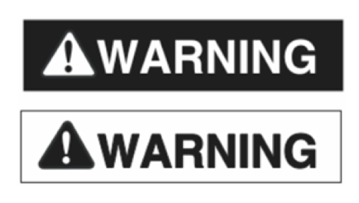

= AsciiDoctor and ANSI Z535
:imagesdir: ../src/css

This is a proposal for a custom extension of https://asciidoctor.org[AsciiDoctor] that provides
support for the https://en.wikipedia.org/wiki/ANSI_Z535[ANSI Z535] standard (especially ANSI Z535.6 that defines requirements for technical documentation).

== What is ANSI Z535
According to Wikipedia,

[quote, Wikipedia definition]
____
ANSI Z535 is an American standard that sets forth a system for presenting safety 
and accident prevention information. It corresponds to the international ISO 3864 standard.
____

It consist of six individual sub-standards, that regulate various aspects for the
documentation of safety and accident prevention information.

The most important sub-standards discussed here are

* ANSI Z535.1 American National Standard for Safety Colors
* ANSI Z535.6 American National Standard for Product Safety Information in Product Manuals, Instructions, and Other Collateral Materials

== Why is that important for AsciiDoctor
ANSI Z535 (especially ANSI535.1 and ANSI Z535.6) defines a set of legal rules, that technical writers have to adhere to write documentation that complies to legal rules.

AsciiDoctor would be perfectly suited for technical documentation. However support for ANSI Z535 is
not implemented and the Admonitions defined in AsciiDoc *do not fullfill* the requirements.

To write ANSI Z535 compliant documentation, every author using AsciiDoctor would have to fiddle around with custom extensions 
and custom CSSes to produce compliant HTML. However, even that would not be sufficient to produce compliant output in other output-formats like PDF. Most
technical authors are not willing or not capable to implement such customizings and therefore 
seek other solutions to write ANSI Z535 compliant documents.

The extension proposed here tries to implement a basic support for ANSI Z535 as an open-source custom extension.

== Scope of the ANSI Z535 Standard
The ANSI Z535 standard defines a sommon design direction intended to provide
product safety information in an orderly and visually consistent manner.

That includes

* Safety colors (i.e. ANSI Red, ANSI Orange)
* Signal Words (i.e. WARNING, CAUTION)
* The Safety Alert Symbol
* Signal Panels

=== Safety Colors
The standard *ANSI Z535.1-2017* defines the following colors:

|===
| Name | Pantone | RGG | RGB hex

| ANSI Red | 186 C | rgb(200, 16, 46) | #C8102E
| ANSI Orange | 151 C | rgb(255, 130, 0) | #FF8200
| ANSI Yellow | 109 C | rgb(255, 209, 0) | #FFD100
| ANSI Green | 335 C | rgb(0, 123, 95) | #007B5F
| ANSI Blue | 285 C | rgb(0, 114, 206) | #0072CE
| ANSI Purple | 259 C | rgb(109, 32, 119) | #6D2077

|===

These colors are used for the formatting of signal words in technical documentation and product safety signs.

For further Information: https://www.nema.org/standards/complimentarydocuments/ansi%20z535_1-2017%20contents%20and%20scope.pdf[American National Standard for Safety Colors]

=== Signal Words
ANSI Z535 defines the signal words

* DANGER
* WARNING
* CAUTION
* NOTICE
* Safety Instructions

There are also rules, which signal word has to be used in certain situations. For example, the signal word "DANGER" must be used if the documented object can cause accidents and these accidents
will cause death or a serious injury.

The rules are out of the scope of this document. What is important is, that 

* there is a defined set of signal words
* there are defined translations for these signal words in different languages

Here is an extract of the translations

|===
| Language | DANGER | WARNING | CAUTION | NOTICE | Safety Instructions

| German | GEFAHR | WARNUNG | VORSICHT | HINWEIS | Sicherheitshinweise
| French | DANGER | AVERTISSEMENT | ATTENTION | AVIS | Consignes de Sécurité
| Spanish | PELIGRO | ADVERTENCIA | ATENCION | AVISO | Instrucciones de Seguridad
|===

[NOTE]
====
Other translations exist and may be supported. Since I am not familiar with these languages, I'll
skip that here.
====

=== The Safety Alert Symbol

The Safety Alert Symbol indicates a potential injury hazard. The Unicode glyph for the 
Safety Alert Symbol is `U+26A0` (#9888 decimal)

:imagesdir: ../src/scss

The symbol can be used in several flavours, which are described in the following table.
[cols="2, 7"]
|===
|  Symbol | Description

a| 
--
image::ANSI-Z535_black_transparent.svg[Static,40]
--
| Black with transparent background

a| 
--
image::ANSI-Z535_black_solid_transparent.svg[Static,40]
--
| Solid black with transparent background

a| 
--
image::ANSI-Z535_black_filled_white.svg[Static,40]
--
| Black with white background

a| 
--
image::ANSI-Z535_black_filled_orange.svg[Static,40]
--
| Black with orange background

a| 
--
image::ANSI-Z535_black_filled_yellow.svg[Static,40]
--
| Black with yellow background

a| 
--
image::ANSI-Z535_black_solid_filled_white.svg[Static,40]
--
| Solid black with white background

a| 
--
image::ANSI-Z535_black_solid_filled_orange.svg[Static,40]
--
| Solid black with orange background

a| 
--
image::ANSI-Z535_black_solid_filled_yellow.svg[Static,40]
--
| Solid black with yellow background

|===

The images may have to be reworked.

=== Signal Panels
Signal words and the safety alert symbol are used to form signal panels. ANSI Z535 defines
which signal words have to be combined with the safety alert symbol and in which foreground-
and background colors have to be used for which signal word.

:imagesdir: ./
[cols="2, 4, 1, 1, 1"]
|===
| Signal Panel | Purpose | Safety Alert Symbol | Foreground | Background

a| image::images/Danger.png[] | 
DANGER indicates a hazardous situation which, if not avoided, 
*will* result in death or serious injury
| yes | white | ANSI Red

a| image::images/Warning.png[] 
| WARNING indicates a hazardous situation which, if not avoided, 
*could* result in death or serious injury
| yes | black | ANSI orange

a| image::images/Caution.png[] 
| CAUTION indicates a hazardous situation which, if not avoided, 
*could* result in minor or moderate injury
| yes | black | ANSI yellow

a| image::images/Notice.png[] 
| NOTICE is used to address practices not related to physical injury
| no | white | ANSI blue

a| image::images/Safety-Instruction.png[] 
| SAFETY INSTRUCTIONS signs indicate specific safety-related instructions
or procdures
| no | white | ANSI green

|===

Signal Panels may also be used in Black and White as demonstrated here:

== Support of the ANSI Z535 Standard in AsciiDoctor
This extension includes custom CSSes and an inline macro to generate signal panels 
for the HTML output of AsciiDoctor.

=== CSSes used by the extension
Safety alert symbols and signal panels are represented by an empty HTML  Element with class 
attributes that define, how the symbol or panel should be rendered. 

The rendering is pure-CSS, including the rendering of the Safety alert symbol.
The symbol-variants are provided as SVG graphics that are used by the stylesheet.

The stylesheets are written in SASS and converted to CSS during the build phase.

==== Safety Alert Symbol rendering
The following CSS classes are used to control the rendering of the
safety alert symbol

:imagesdir: ../src/scss

|===
| Class | Description | Renders

| ansi-alert-black | The safety symbol in black with transparent background
a| 
--
image::ANSI-Z535_black_transparent.svg[Static,40]

| ansi-alert-black-solid | The safety symbol filled in black with transparent background
a| 
--
image::ANSI-Z535_black_solid_transparent.svg[Static,40]

| ansi-alert-white | The safety symbol in white with transparent background
| -- NOT VISIBLE HERE --

| ansi-alert-white-filled | The safety symbol filled in white with transparent background
| -- NOT VISIBLE HERE --

|===

==== Safety Panel rendering
The following CSS classes are supported:

|===
| Class | Description

| ansi-danger | A signal panel with signal word DANGER
| ansi-warning | A signal panel with signal word WARNING
| ansi-caution | A signal panel with signal word CAUTION
| ansi-notice | A signal panel with signal word NOTICE
| ansi-safety-instructions | A signal panel with signal word Safety Instructions

|=== 

If no additional class is set, the signal panel will be rendered in color and with english signal words.

To change the display style, the following additional classes are supported

|===
| Class | Description

| ansi-style-bw | The signal panel is rendered in black on white background
| ansi-style-wb | The signal panel is rendered in white on black background
| ansi-style-border | The signal panel is rendered with a black border. This 
style can also be used when the panel is rendered in color

|===

To change the language for the signal word, the following additional classes are supported

|===
| Class | Description

| ansi-lang-de | The signal word is rendered in German
| ansi-lang-fr | The signal word is rendered in French
| ansi-lang-es | The signal word is rendered in Spanish

|===

=== Example

The file link:Z535-Overview-styles.html[] shows how to use the CSS classes. The rendered output in the browser is documented in the file link:Z535-Overview-styles.png[].

== References

* https://en.wikipedia.org/wiki/ANSI_Z535[Wikipedia ANSI Z535]
* https://www.appliedsafety.com/wp-content/uploads/2011/08/ansi_z535dot6_article.pdf[Update on ANSI Z535.6]
* https://www.nema.org/Standards/z535/Documents/Communicator_article_p14-16.pdf[Article on ANSI Z535.6 and product safety]
* https://medium.com/@malcolm.abbott/the-ansi-z535-standards-and-their-scope-ad8d7b21c85a[The ANSI Z535 Standards and their Scope]

=== Symbols
* http://en.wikipedia.org/wiki/Hazard_symbol[Hazard Symbols]

=== German References
Some signs that are used in Germany

* http://de.wikipedia.org/wiki/Warnzeichen[Warning Symbols according to ISO 7010]
* http://de.wikipedia.org/wiki/Verbotszeichen[Prohibtion Signs]
* http://de.wikipedia.org/wiki/Brandschutzzeichen[Fire Protection Signs]
* http://de.wikipedia.org/wiki/Gebotszeichen[Mandatory Signals]
* http://de.wikipedia.org/wiki/Rettungszeichen[Rescue Signs]

Some german resourcen describing the handling of Safety- and Warning-Information in technical documentation

* https://www.schmeling-consultants.de/de/nc/publikationen/?fd=NORM_04_Schulz_Schmeling_Neuer_tekom_Leitfaden_Sicherheits_Warnhinweise.pdf[Leitfaden Sicherheits- und Warnhinweise]

